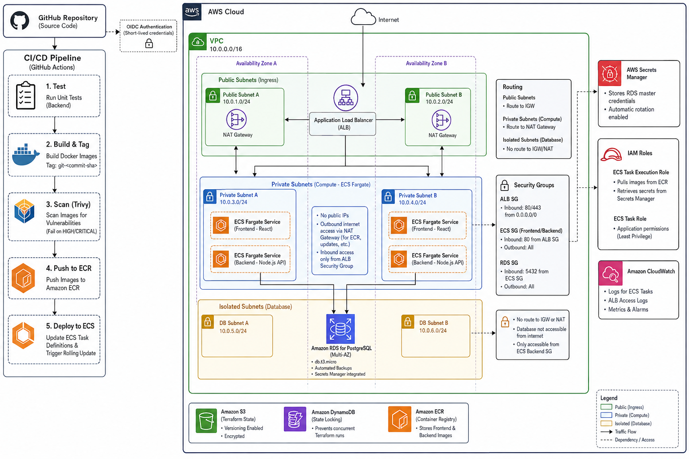

# Octa Byte DevOps & Cloud Infrastructure Architecture

The repository includes the declarative Infrastructure as Code (IaC) and Continuous Deployment pipelines designed for hosting the Octa Byte Transaction Service, and the main aim of the project is to demonstrate a production-grade, highly secure, and fully automated DevOps setup on Amazon Web Services (AWS).

---

## 1. Executive Summary

The project shows the move from local development to a robust, enterprise-grade cloud environment, with a strict emphasis on infrastructure operations, security, and deployment automation.

Key engineering achievements include:

- **100% Infrastructure as Code (IaC):** The use of Terraform will result in a complete removal of manual AWS console provisioning.
- **Serverless Architecture:** Migrate from virtual machines to container orchestration with no need for maintenance using AWS ECS Fargate.
- **Zero-Trust Networking:** The use of a strict multi-tier VPC topology featuring isolated database subnets.
- **Automated management of the secret lifecycle:** the removal of hard-coded secrets through the use of dynamic rotation by AWS Secrets Manager.
- **Continuous Deployment (CD):** A GitHub Actions pipeline that is completely automated, including OIDC authentication, vulnerability scanning, and deployments performed by rolling updates with zero downtime.

---

## 2. The Application Context (Short version)

While the focus of this repository is operations, it hosts a decoupled three-tier application:

- **Frontend:** A static single-page application built with React and served using Nginx.
- **Backend:** A REST API built with Node.js and Express which carries out the business logic and automatically initializes the database schemas when it is started.
- **Database:** A PostgreSQL relational database.
  – **Routing:** The application makes use of the cloud infrastructure (the Application Load Balancer) for all of its traffic routing and reverse-proxying.

---

## 3. Cloud Infrastructure Setup (AWS)

The infrastructure was designed to ensure high availability, to provide fault tolerance, and to have as little operational overhead as possible.

### 3.1 Serverless Compute (ECS Fargate)

The application workload is hosted on Amazon Elastic Container Service (ECS) using the Fargate launch type.

- **Zero-Ops Compute:** Fargate hides the underlying EC2 instances, thus getting rid of the need for OS patching, AMI management, and cluster capacity scaling.
- **Task Definitions:** Strict Task Definitions are used to specify the amount of CPU and memory allocated to containers, as well as the environment variables and the routing of CloudWatch logs.

### 3.2 Relational Database Service (RDS)

The data tier uses Amazon RDS for PostgreSQL.

– The lifecycle is managed by RDS through automated snapshot backups, automatic application of minor version patches, and the allocation of storage.

- **Burstable Performance:** The service is deployed on db.t3.micro instances so that it can handle transactional workloads featuring variable usage spikes in a cost-effective manner.

### 3.3 Networking Topology (VPC Design)

The environment is based on a custom Virtual Private Cloud (VPC) that covers two Availability Zones (AZs) in order to ensure resilience, and it implements a strict three-tier subnet structure:

1. **Public Subnets:** These include only the Application Load Balancer (ALB) and the NAT Gateways; they have routes to an Internet Gateway (IGW) to enable public ingress.
2. **Private Compute Subnets:** These contain the ECS Fargate tasks and are configured so that outbound internet traffic is routed via the NAT Gateway (since this is needed for pulling ECR images), while at the same time blocking all direct public ingress.
3. **Isolated Database Subnets:** These subnets house the RDS instance and have no routes to the IGW or NAT Gateway, which means that the database is physically isolated from the public internet.

3.4 Consolidated load balancing

In order to keep the services decoupled while at the same time reducing costs, a single Application Load Balancer (ALB) is used to handle all the incoming traffic.

- **Path-Based Routing:** When the ALB Listener receives a request it checks the request path; if the path matches /api/\* then the request is dynamically directed to the Backend ECS Target Group, otherwise it is sent to the Frontend ECS Target Group.
  – Health checks: The ALB constantly monitors the /health endpoint of the backend and the root path of the frontend, automatically removing traffic from unhealthy containers.

---

## 4. The security and compliance position

Security is woven into the infrastructure using a defense-in-depth methodology:

### 4.1 Zero-Touch Secrets Management

The inclusion of database credentials that are hardcoded represents a serious security vulnerability.

- **Creation and Rotation:** Terraform uses the manage_master_user_password feature to tell AWS Secrets Manager to create a high-entropy password for the RDS instance and to automatically manage the ongoing rotation of that password.
- **Dynamic Injection:** The Backend ECS Task Execution Role is given specific IAM permissions enabling it to read this secret. When the container is starting up, the AWS ECS Agent dynamically injects the decrypted secret into the container as an environment variable.

### 4.2 Security Groups with the Least Privilege

Network traffic is strictly firewalled at the Elastic Network Interface (ENI) level:

- The ALB Security Group permits inbound HTTP (on port 80) and HTTPS (on port 443) from 0.0.0.0/0.
  – For the frontend and backend ECS security groups, all public inbound traffic should be explicitly denied and the only inbound traffic that is accepted is that which comes directly from the ALB security group.
- **RDS Security Group:** It allows inbound TCP traffic on port 5432 only from the Backend ECS Security Group.

### 4.3 Container Immutability and IAM Roles

- **Read-Only Root Filesystems:** The ECS container definitions enforce
  The readonly root filesystem is set to true since this stops malicious users from installing rootkits or altering the application binaries after deployment. Temporary write access is only given to certain volumes (for example, /var/cache/nginx) by means of ephemeral mpfs mounts.
- **Role Separation:** The IAM permissions are strictly separated, with the **Task Execution Role** being used by the ECS agent underneath to pull images and retrieve secrets, and the **Task Role** being used by the application runtime itself when interacting with AWS services so that the application code cannot access the deployment secrets.

---

## 5. Infrastructure as Code (Terraform)

The entire infrastructure is coded using Terraform, which ensures that the environments are reproducible, auditable, and free from configuration drift.

- **Modular Design:** The Terraform codebase is separated into reusable logical modules (vpc, ecs,
  This DRY (Don't Repeat Yourself) method enables identical infrastructure topographies to be set up for staging or for production by just inserting different .tfvars files.
  – Remote State Management: The Terraform state file (terraform.tfstate) is kept in an encrypted Amazon S3 bucket with versioning turned on in order to avoid data loss.
- **State Locking:** State locking is implemented natively via the S3 backend using the modern `use_lockfile = true` feature. This eliminates the legacy requirement for a separate DynamoDB table, reducing infrastructure complexity while still guaranteeing that simultaneous writes do not corrupt the infrastructure state during CI/CD pipeline executions.

---

## 6. Continuous Integration and Deployment (CI/CD)

The entire deployment lifecycle is automated using GitHub Actions (.github/workflows/deploy.yml) and thus true Continuous Deployment is achieved.

### 6.1 OIDC Authentication

The system uses OpenID Connect (OIDC) to authenticate with AWS; it is a security anti-pattern to store long-lived AWS Access Keys as GitHub Secrets, since GitHub instead exchanges a signed JWT token with AWS in order to obtain short-lived, temporary deployment credentials, which greatly reduces the scope of damage in the case of a compromised CI system.

### 6.2 Pipeline Execution Flow

1. **Testing Phase:** The unit test suite is run against the backend API to make sure there are no code regressions.
2. **Build & Tagging Phase:** The Docker images for both the frontend and the backend are built. These images are dynamically given tags using the Git commit SHA (for example, git-7b9a2f1) in order to ensure that the deployments are immutable and can be traced back to specific changes in the code.
3. **Vulnerability Scanning (Trivy):** The pipeline incorporates AquaSecurity Trivy in order to scan the container images that have been built. It stops deliberately if any HIGH or CRITICAL Common Vulnerabilities and Exposures (CVEs) are found in the base operating system or in the dependencies.
4. **Push Phase:** The secure images are pushed to Amazon Elastic Container Registry (ECR).
5. **Deployment Phase:** The active ECS Task Definitions are downloaded, the new ECR image URIs are injected, and the new revisions are registered with AWS.
6. **Zero-Downtime Rollout:** This causes an ECS rolling update, during which ECS sets up the new containers, waits until they have passed the ALB health checks, adds them to the Target Group, and then smoothly removes the active connections from the old containers.

---

## 7. Cloud Deployment Instructions

### Prerequisites

- AWS CLI configured with administrative access
- Terraform >= 1.5.0

### Provisioning the Infrastructure

Go to the directory of the production infrastructure:
`cd terraform/environments/prod` 2. Set up Terraform (which downloads the AWS providers and configures the remote S3 backend):
`terraform init` 3. Have a look at the infrastructure execution plan:
`terraform plan`
Provide the infrastructure on AWS:
`terraform apply`
When the process has been completed, Terraform will give you the alb_dns_name. This is the URL for your live website.
